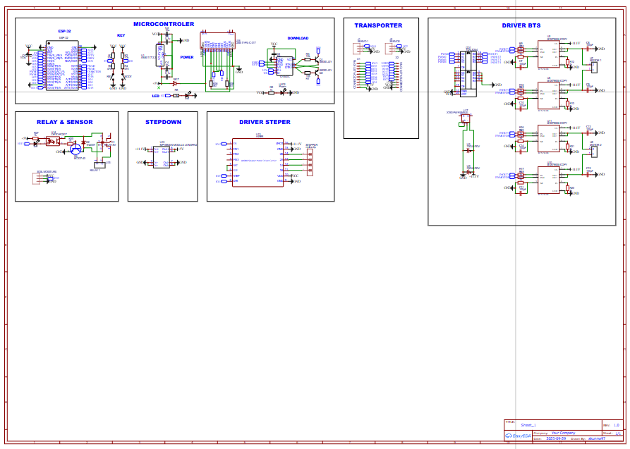

# Minimum-System-EP32-BTS7960

  

## Overview

This repository contains a **microcontroller-based minimum system PCB** designed as a centralized control unit for embedded and control-oriented applications. The board integrates a microcontroller with multiple output interfaces, allowing it to function as the main controller for external drivers, actuators, and expansion modules.

The design emphasizes **functional clarity, modularity, and ease of development**, making it suitable both as a development platform and as a control core for real-world implementations. With a structured layout and clear signal separation, the PCB supports reliable operation and future system expansion.

---

## Functional Description

The PCB serves as the **core processing and control unit** of an embedded system. The integrated microcontroller executes control logic, processes input signals, and manages multiple output channels. These outputs can be used to interface with external motor drivers, control modules, or other peripheral systems.

By combining control logic and output management on a single board, this minimum system simplifies system architecture and reduces the need for additional interface circuitry. The design is intended to be flexible, allowing developers to adapt it to various applications without significant redesign.

---

## Design Characteristics

- Microcontroller-based minimum system as the main control core  
- Multiple output channels for external modules and actuators  
- Clean and organized PCB layout for easy understanding and integration  
- Clear silkscreen labeling to support assembly, debugging, and maintenance  
- Designed for scalability and further system expansion  

---

## PCB Layout Preview

### Top Layer

  

### Bottom Layer

  

---

## 3D View

### Top View

  

### Bottom View

  

---

## Schematic

  

The schematic illustrates the logical structure of the minimum system, including the microcontroller core and its connections to output interfaces. This schematic acts as the reference for understanding signal flow and functional relationships within the system.

---

## Repository Contents

- `Layout PCB.json` – PCB layout design file  
- `Schematic PCB.json` – Schematic design file  
- `Layout Top.png` – Top layer PCB layout image  
- `Layout Bottom.png` – Bottom layer PCB layout image  
- `3d top.png` – 3D top view of the PCB  
- `3d bottom.png` – 3D bottom view of the PCB  
- `schematic.png` – Schematic preview image  

---

## Applications

This minimum system PCB can be used as:
- A main control board for robotics systems  
- A controller platform for automation projects  
- A development board for embedded system experimentation  
- A centralized control unit for systems requiring multiple outputs  

---

## Notes

This design is intended as a flexible and expandable minimum system. Users are encouraged to adapt and modify the design according to their specific project requirements.

---

© 2026 – Minimum-System-EP32-BTS7960
